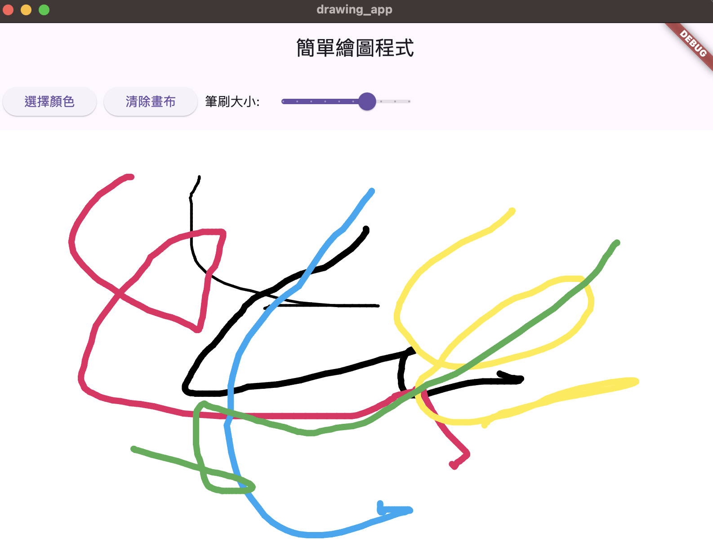

# flutter_drawing_app

# 成果圖
   

# 簡單繪圖程式 (Simple Drawing App)

這是一個使用 Flutter 開發的簡單繪圖應用程式，提供基本的繪圖功能。

## 功能特點

- 自由繪圖：使用手指或滑鼠在畫布上繪製
- 顏色選擇：提供多種顏色選項，並有視覺化的選色介面
- 筆刷大小：可調整筆刷粗細（1-10像素）
- 清除功能：一鍵清除整個畫布

## 安裝需求

- Flutter SDK (建議使用最新版本)
- Dart SDK
- Android Studio 或 VS Code
- iOS 模擬器或 Android 模擬器（可選）

## 安裝步驟

1. 下載專案：
```bash
git clone [專案URL]
```

2. 進入專案目錄：
```bash
cd drawing_app
```

3. 安裝依賴：
```bash
flutter pub get
```

4. 運行應用：
```bash
flutter run
```

## 使用說明

1. 繪圖
   - 在畫布上拖動即可繪圖
   - 支持連續筆觸

2. 更改顏色
   - 點擊「選擇顏色」按鈕
   - 在彈出的顏色選擇器中選擇想要的顏色
   - 點擊確定套用新顏色

3. 調整筆刷
   - 使用滑桿調整筆刷大小
   - 可選擇 1-10 像素的筆刷粗細

4. 清除畫布
   - 點擊「清除畫布」按鈕可清除所有內容

## 專案結構

drawing_app/
├── lib/
│ └── main.dart # 主程式碼
├── pubspec.yaml # 專案配置文件
└── README.md # 說明文件

## 技術細節

- 使用 `CustomPaint` 實現繪圖功能
- 使用 `GestureDetector` 處理觸摸事件
- 實現自定義的顏色選擇器
- 狀態管理使用 `setState`

## 貢獻指南

歡迎提交 Pull Requests 來改善這個專案。請確保您的程式碼符合以下要求：

1. 遵循 Flutter 的程式碼風格指南
2. 添加適當的註釋
3. 更新相關文檔

## 授權

本專案採用 MIT 授權條款。

## 聯絡方式

如有任何問題或建議，請提交 Issue 或聯繫專案維護者。